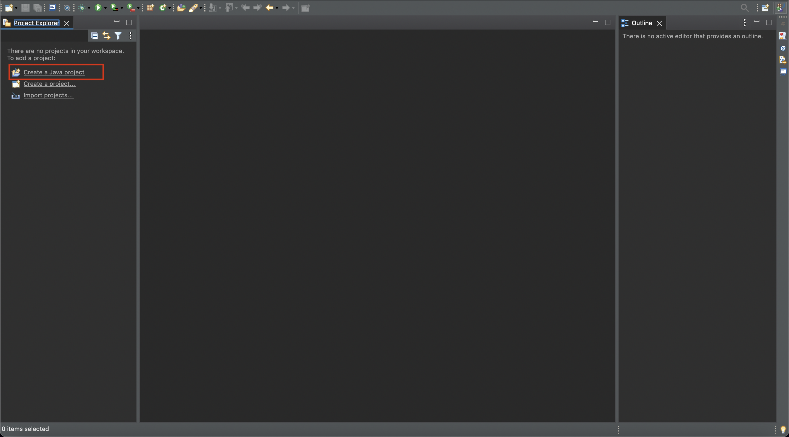
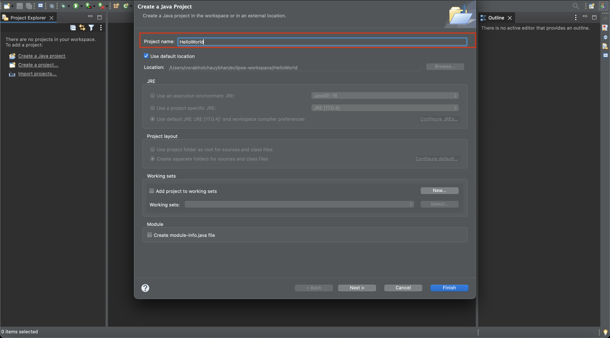
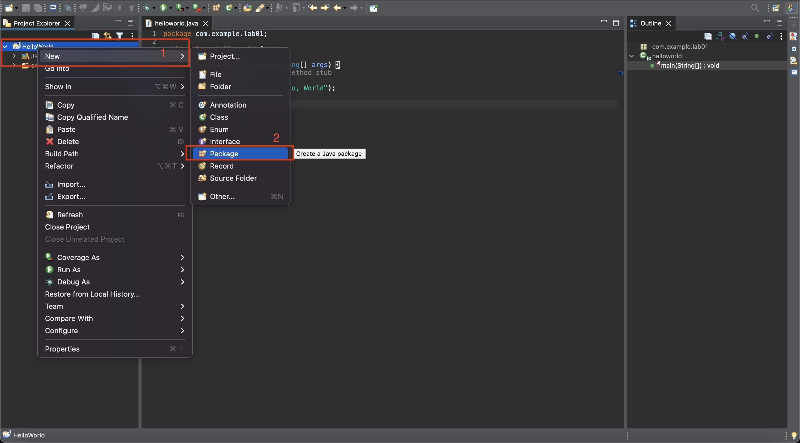
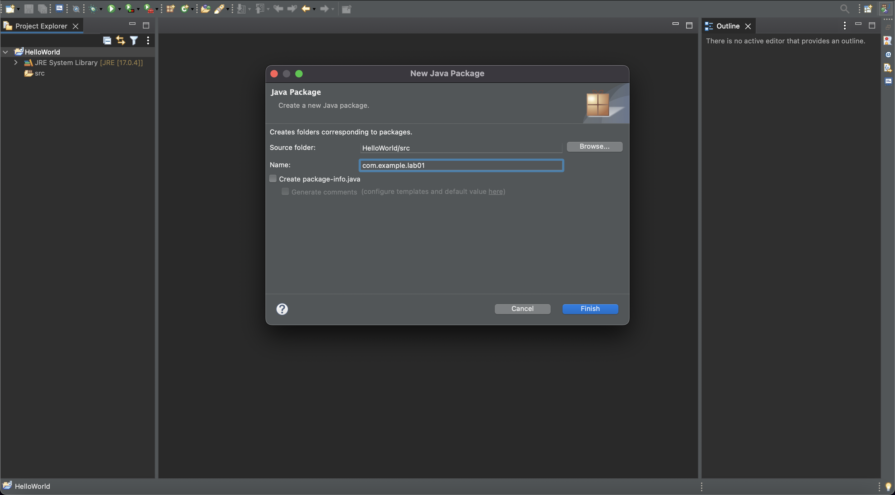
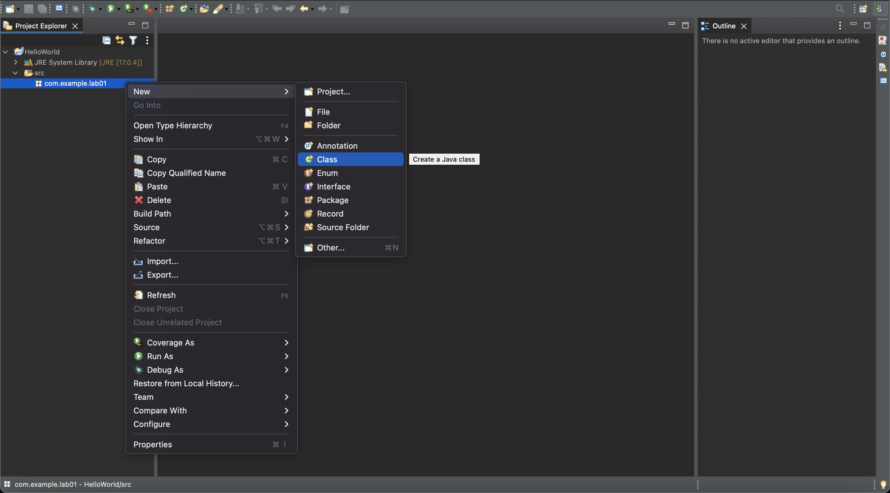
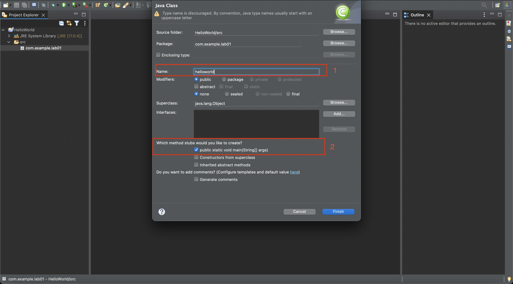
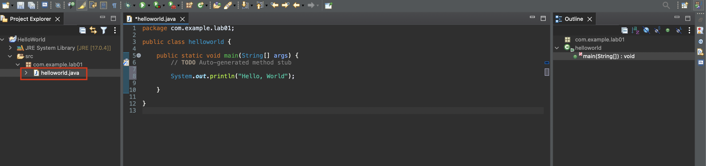
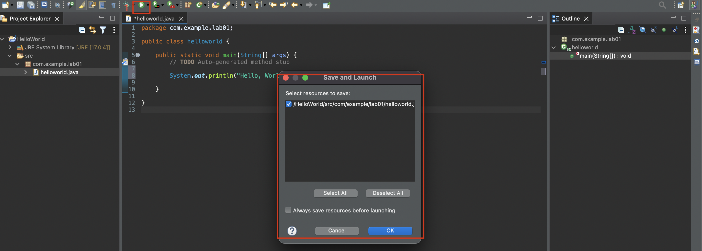
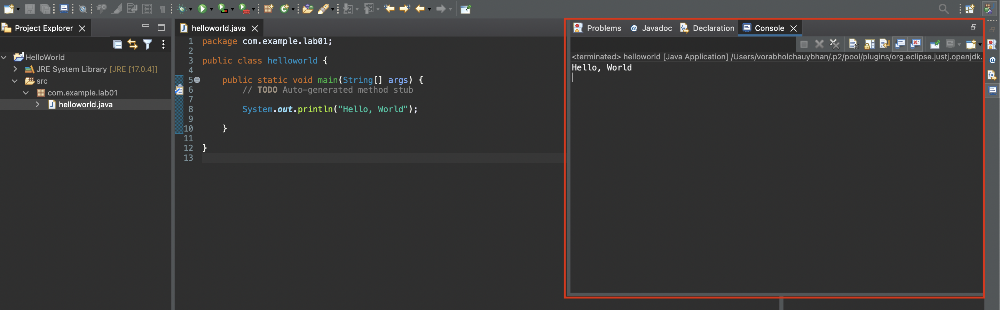

---
# Feel free to add content and custom Front Matter to this file.
# To modify the layout, see https://jekyllrb.com/docs/themes/#overriding-theme-defaults

title: Lab-01 hello world console
layout: default
permalink: labs/01-hello-world-console
parent: Labs
---
## Lab 01 Hello World
หลังจากติดตั้งเสร็จสิ้นใน lab นี้จะทำการทดสอบความพร้อมใช้งานของ IDE โดยการพิมพ์ข้อความ ออกทางconsole
### สร้าง project
1. สร้าง project java ใหม่
   [](../assets/img/lab01-01.png)
2. ใส่ชื่อ project แล้ว ยกเลิกตัวเลือก create java module หลังจากนั้นกด finish
   [](../assets/img/lab01-02.png)
### สร้าง package
1. ไฟล์ class จะต้องอยู่ใน package ได package หนึ่ง ทำการสร้าง package ใหม่โคยคลิ๊กขวาที่ชื่อโปรเจคที่ได้จากข้อ 2 จากนั้น เลือก new
   [](../assets/img/lab01-03.png)

2. ใส่ชื่อ package Hello world
   [](../assets/img/lab01-04.png)

### สร้าง class
 ไฟล์ class นั้นเป็น resource ประเภทหนึ่งใน java ที่ประกอบไปด้วยรายละเอียดต่างๆ ของโปรแกรมที่จะrunตามข้อกำหนดของภาษาซึ่งใน lab นี้จะไม่ได้กล่าวถึงส่วนนั้น
1. คลิ๊กขวาที่ชื่อ project > new > class
   [](../assets/img/lab01-05.png)
2. ใส่ชื่อ class แล้ว กดเลือก option
    ```public static void main (String[] args)```

   [](../assets/img/lab01-06.png)
3. ใส่ code ในไฟล์ Helloworld.java ดังต่อไปนี้
```java
public static void main(String[] args) {
  System.out.println("Hello World!");
}
```
   [](../assets/img/lab01-08.png)
4. กดปุ่ม run เพื่อทำการ compile code และ run โดยจะมีข้อความใน medthod println ที่เราได้ใส่เข้าไปว่า "Hello World!"

   [](../assets/img/lab01-08.png)

5. ตรวจสอบผลลัพธ์ ที่หน้า console ของ program
   [](../assets/img/lab01-09.png)
