---
# Feel free to add content and custom Front Matter to this file.
# To modify the layout, see https://jekyllrb.com/docs/themes/#overriding-theme-defaults

title: Lab-02 hello world GUI
layout: default
permalink: labs/02-hello-world-gui
parent: Labs
---
## Lab 02 Hello World GUI
หลังจากที่เราได้ลอง hello world ด้วย console ไปแล้วใน lab นี้เราจะมาลอง hello world ด้วย GUI
ที่เป็น program แสดงข้อความ helloworld
### ติดตั้ง package windowsbuilder
1. click ที่ help จาก toolbar > Eclipse Marketplace
   [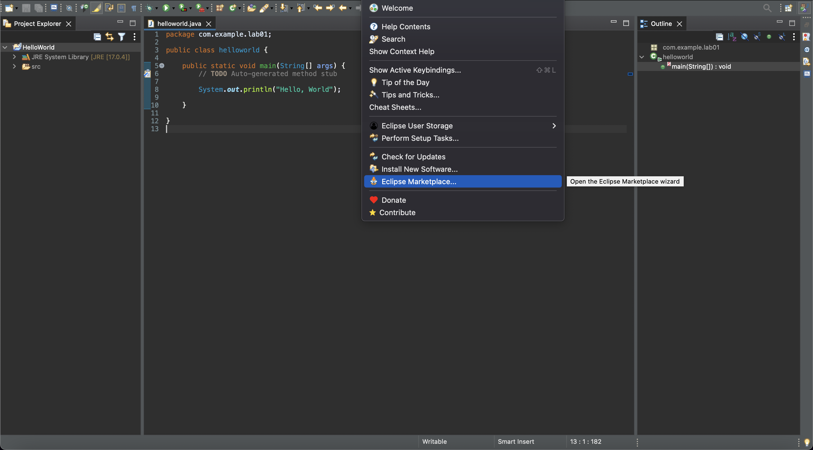](../assets/img/lab02-01.png)
2. ค้นหา "Window Builder" ที่ช่องค้นหา แล้วกด install
   [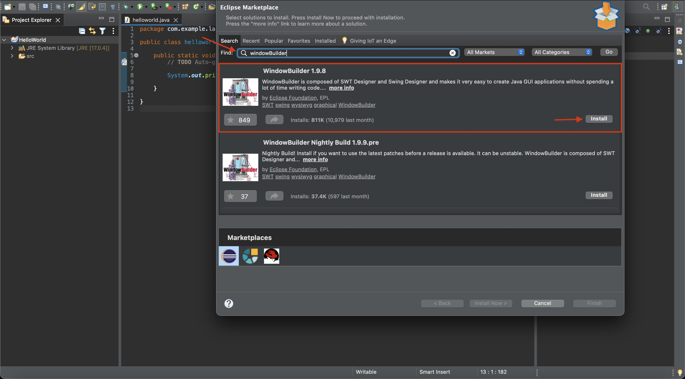](../assets/img/lab02-02.png)
3. กดเลือก package ทั่้งหมดแล้วกด confirm เพื่อยืนยันการติดตั้งแล้ว
   [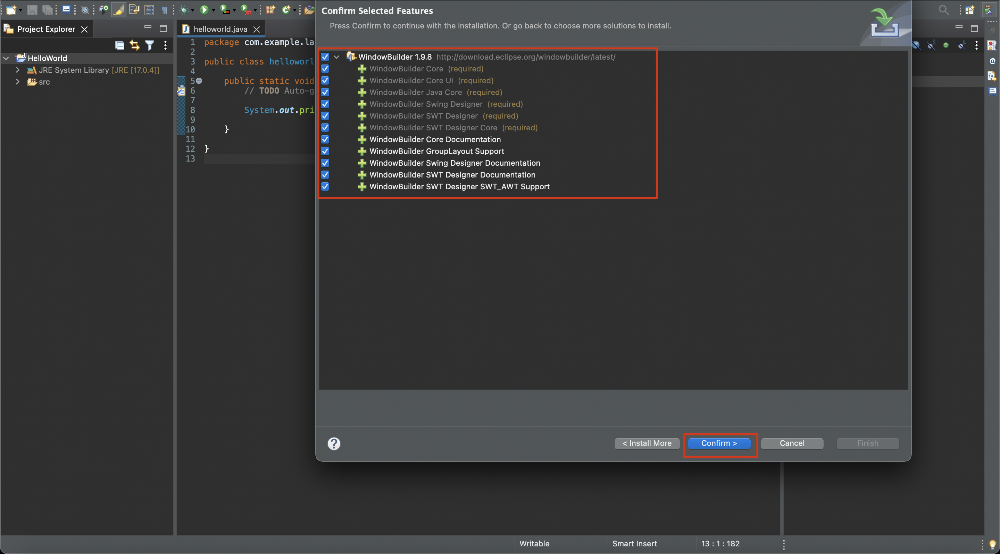](../assets/img/lab01-03.png)
4. กดยอมรับข้อตกลงการใช้งาน package แล้วกด ยีนยัน
   [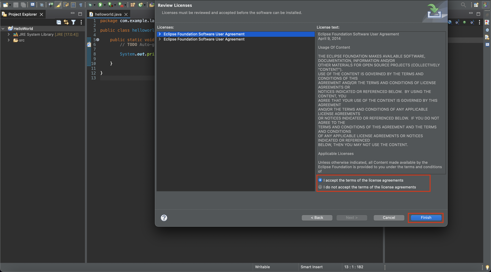](../assets/img/lab02-04.png)

### สร้าง project Window Builder
ในการสร้าง GUI application นั้นจะใช้ package window builder ในการสร้างดังนั้นเราจึงสร้าง project ใหม่ที่รองรับ window builder package
1. คลิ๊กขวาที่ชื่อ project > new > project
 [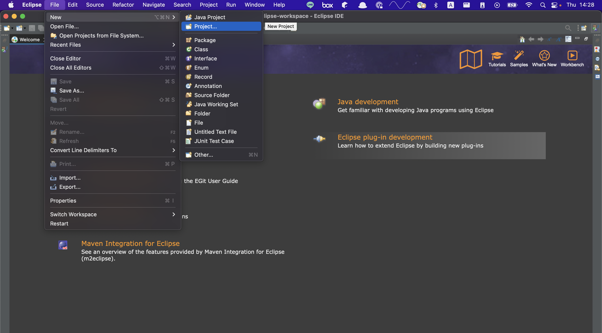](../assets/img/lab02-5.png)

2. เลือกประเภท package windows builder
   [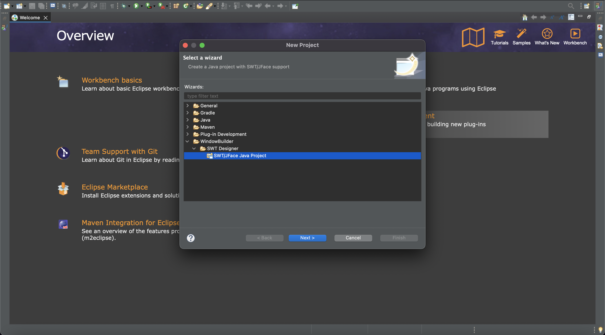](../assets/img/lab02-6.png)
3. ใส่ ชื่อ project แล้วกด finish

   [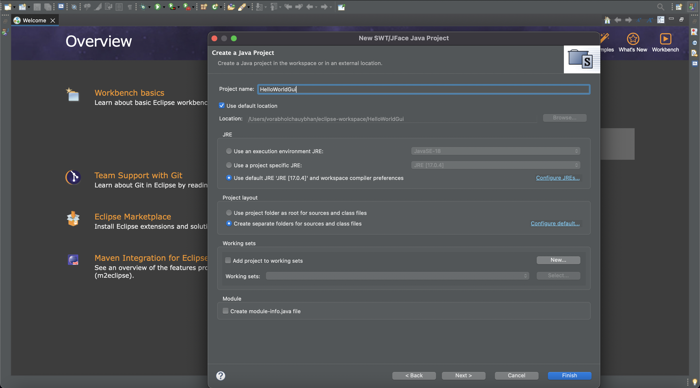](../assets/img/lab02-8.png)
### สร้าง หน้าต่าง GUI
4. หลังจากสร้าง project windows builder แล้วจะได้โฟลเดอร์ว่างๆ มา 1อัน ดังนั้นเพื่อเริ่มการพัฒนาเราจริงต้องสร้าง package
   [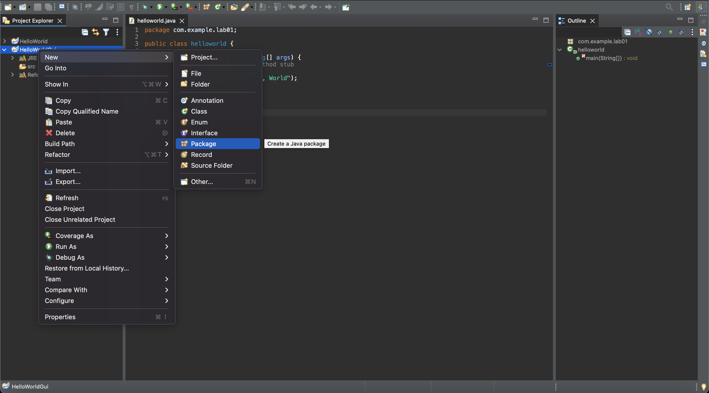](../assets/img/lab02-09.png)

5. คลิ๊กขวาที่ชื่อ package helloworld GUI แล้วเลือก other
   [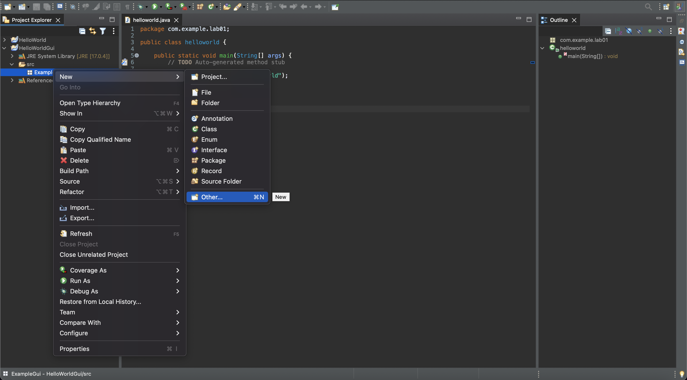](../assets/img/lab02-11.png)
6. เลือก Application Window
[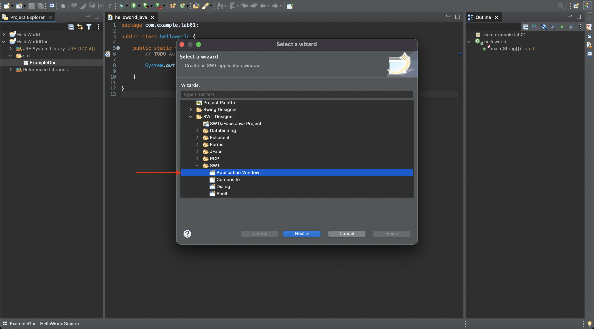](../assets/img/lab02-12.png)
7. จากนั้นทดสอบโดยการกด run จะได้ผลลัพธ์เป็นหน้าจอโปรแกรมว่างๆ 1 หน้าต่าง
   [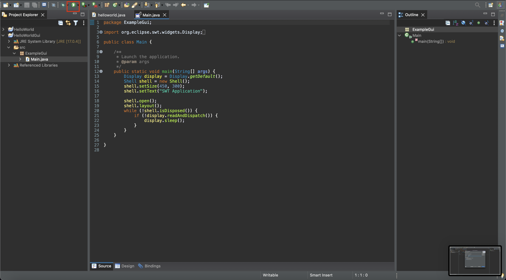](../assets/img/lab02-14.png)
   [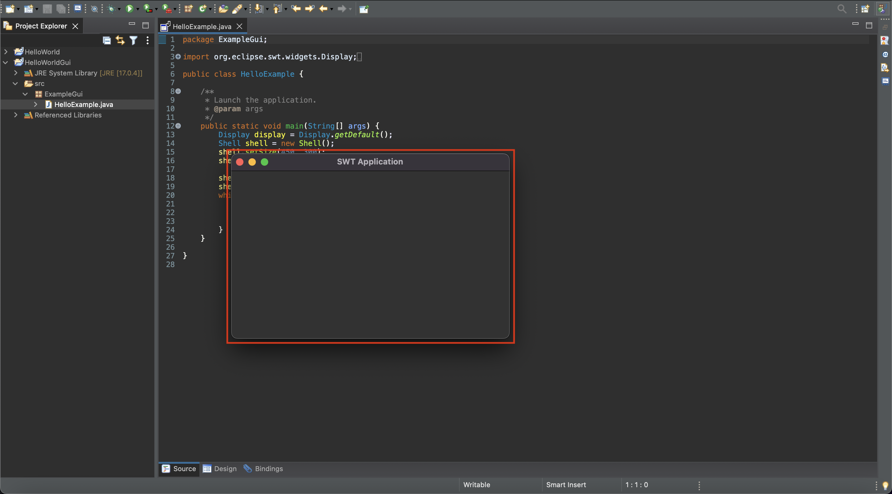](../assets/img/lab02-15.png)
8. ที่ไฟล์ class ให้ใส่ code ต่อไปนี้ แล้วกด run

```java
public class HelloExample {

	/**
	 * Launch the application.
	 * @param args
	 */
	public static void main(String[] args) {
		Display display = Display.getDefault();
		Shell shell = new Shell();
		shell.setSize(450, 300);
		shell.setText("SWT Application");
		shell.setLayout(null);

		Label lblNewLabel = new Label(shell, SWT.NONE);
		lblNewLabel.setAlignment(SWT.CENTER);
		lblNewLabel.setBounds(125, 101, 153, 14);
		lblNewLabel.setText("Hello World");

		shell.open();
		shell.layout();
		while (!shell.isDisposed()) {
			if (!display.readAndDispatch()) {
				display.sleep();
			}
		}
	}
}
```

[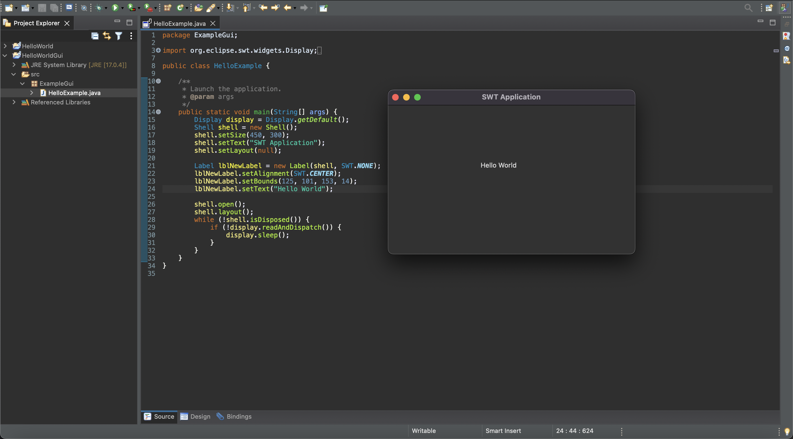](../assets/img/lab02-16.png)
