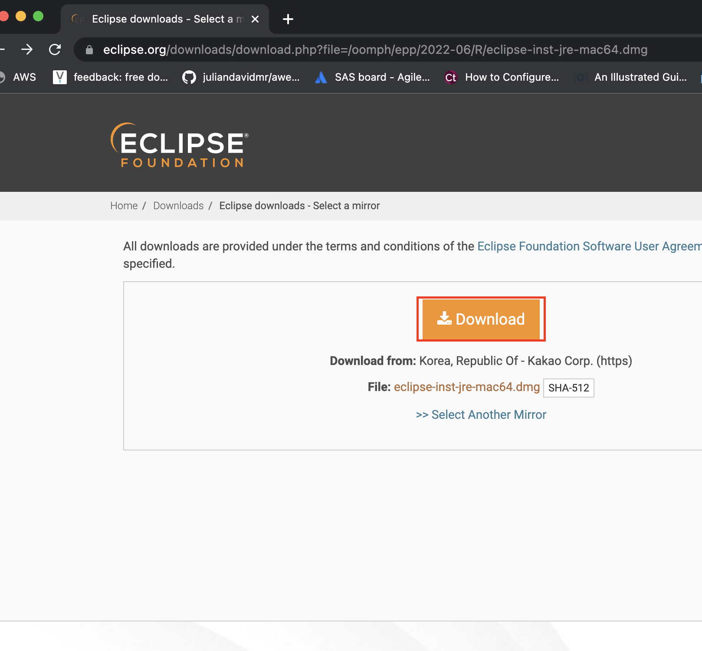

---
# Feel free to add content and custom Front Matter to this file.
# To modify the layout, see https://jekyllrb.com/docs/themes/#overriding-theme-defaults

title: Labs 00
layout: default
permalink: labs/00-set-up-env
parent: Labs
---
## Lab 00 การเตรียมenvironement เพื่อการพัฒนา Java ด้วย eclipse

ในการเตรียมสภาพแวดล้อมเพื่อการพัฒนาapplication ภาษา java นั้นได้มีเครื่องมือมากมายในการพัฒนา
แต่ใน lab นี้จะเน้นไปที่ Eclipse เพราะใช้งานได้ฟรี และใช้ง่ายง่าย
1. Download Eclipse IDE ที่ [https://www.eclipse.org/downloads](https://www.eclipse.org/downloads)

   
2. กด Download แล้วรอซักครู่ จะมี application ให้กด save ลงเครื่องจากนั้นรอจนดาวน์โหลดสำเร็จ

   
3. ทำการกดติดตั้ง application โดยจะมีตัวช่วยติดตั้งขึ้นมาให้เลือกversion ที่จะติดตั้งให้เลือก Eclipse IDE for Java Developers

   
4. กด install แล้วรอ

   

5. เมื่อติดตั้งเสร็จสิ้นแล้วให้กดปุ่มสีเขียว launch เพื่อเปิด IDE

   

6. จะมีหน้าต่างถามให้สร้าง workspace ขั้นตอนนี้กดข้ามได้เลย

   

7. รอจนปรากฏหน้าต่าง Eclipse IDE

   

